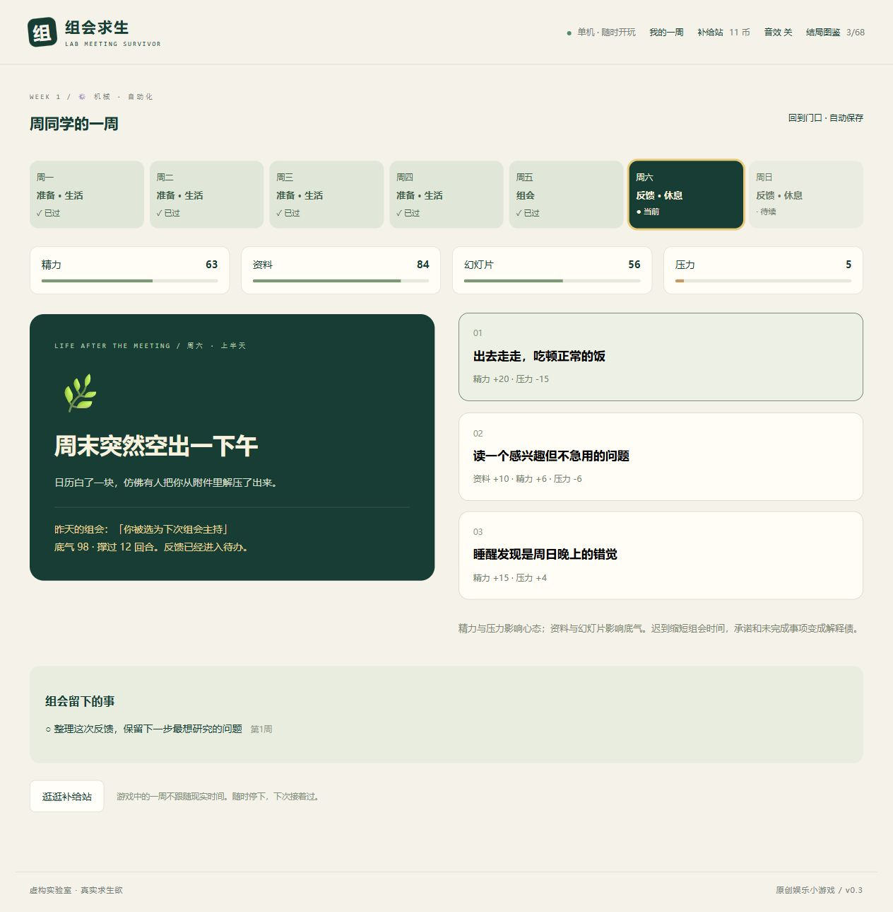
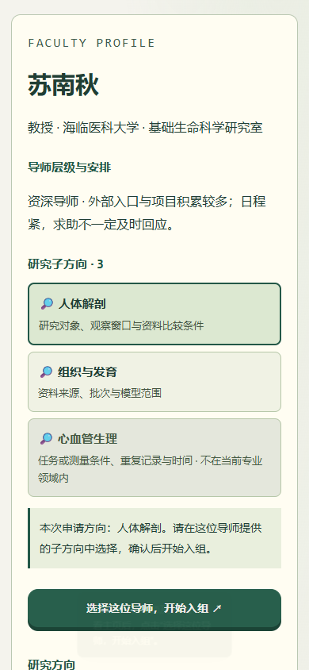

# 组会求生 · Lab Meeting Survivor

## v0.14.7：一天安排多件事，精力和耐心更从容

普通生涯改成按活动耗时推进，主页显示09:00、10:30等时刻。回复、吃饭、阅读、核对分别占15–180分钟，可以安排多件事，也可提前结束今天。普通工作场景提供休息入口，周初经费与交办回复先沟通；精力低时仍能做轻任务，集中工作有明确门槛，跨日恢复，日常精力消耗降低。

普通组会减轻叠加后的耐心损失，为有依据和合理说明局限的回答留出讨论空间；严重违背核对要求仍会失败。散会后回到周五下午继续生活。普通旧存档恢复后使用新节奏，同局挑战保留原轨迹。

[玩法与数值范围](docs/PLAY_PACING.md) · [验证记录](docs/QA_v0.14.7.md)。


## v0.14.6：研究档案接上连续故事，组会频率可选

2,484个方向均补齐基础／前沿研究档案，包括目标、材料、比较、替代解释、交付与范围；组合生成4,968份方案，新增66条案例细化规则。故事会引用实际人物和处理日志，旧方向故事不会被新题覆盖，投稿修稿继续使用稿件快照。方案复用学科证据模块，不宣称全部为独立手写或专家审定。

新游戏默认每两周组会，也可选每周或每四周。没有组会的周完整过14个生活时段，第一场隔周组会前有23个时段；下一场时间始终显示。旧存档与同局挑战保持原节奏。

[本版玩法与内容范围](docs/RESEARCH_DOSSIERS.md) · [逐方向档案](docs/DIRECTION_DOSSIERS.csv) · [验证记录](docs/QA_v0.14.6.md)。

## v0.14.5：基础问题与前沿探索进入课题、准备和组会

方向内容库增加基础／前沿提案、可保存的研究侧重和研究实例卡。侧重进入日常准备、五类专业追问和学习札记；开始实际行动后随课题版本保留，新题或转向后可重新选择。阅读不生成准备，前沿没有自动分数或成果奖励。

2,484个方向使用103个共享模块、206个核心提案和29条细分改写规则；实际改写137个方向。新增21个现实研究实例入口，逐项标注查阅范围与证据限制，没有直接近期实例的方向明确保留待查。[内容与机制范围](docs/RESEARCH_AGENDAS.md) · [方向对应](docs/RESEARCH_AGENDAS.csv) · [研究实例](docs/RESEARCH_REFERENCES.csv) · [验证记录](docs/QA_v0.14.5.md)。网页、离线文件、Windows包和四语言PWA同步构建。

## v0.14.4：方向内容、现实参考与可以回看的作答解析

每个方向增加内容库入口：研究问题、工作材料、核对思路、典型疑点、解释边界、三步阅读思路和小练习。内容连接日常准备、专业组会题与学科长线；组会结束保留最近80条学习札记。阅读不增加准备，不替代实际工作。修正分析化学、原子与分子物理、人文地理等关键词造成的语境错配。

2,484个方向使用103个共享主题模块和43条细分核对规则；本次进一步细化281个方向。29个公开一手参考入口按学科或方法范围映射，明确区分背景资料与具体方法，不宣称每个方向已获专家逐题审核。[内容与来源对应](docs/DIRECTION_STUDY.csv) · [编写方式与范围](docs/DIRECTION_LIBRARY.md)。

导师增加教师与研究员两种序列，以及教学型、科研型、教学科研型侧重。支持型导师给出具体补救反馈，也保留证据扣分、追问、随机负面和退出条件；职级晋升显示对应序列的名称。研究岗位的教学安排、加入现校和晋升文字同步修订。

调整组会标签、介绍段落与同门阵列的布局，保留一页入口和折叠阅读。网页版、四语言离线HTML与Windows应用包同步更新。[本版验证与限制](docs/QA_v0.14.4.md)。

## v0.14.3：相处之后，约定与交接继续留在故事里

课题组卡片和离组同门的年鉴增加“相处记录”，回看实际带教、求助、借用、交办与合作；下一次交谈会提到具体的相处经历。阅读不改变游戏状态，旧存档缺少的结果不会猜成成功。

提前归还会同时交回对应的资源入口；帮忙换延期需要对方同意，不能越过临近答辩的使用安排。人物承诺保留当事人与来源，推迟会继续追问，实际科研核对不再自动完成帮忙承诺。修正借用逾期后求助仍读取旧关系、材料未交接却被写成已经提供、署名争议被写成已确认等衔接。[本版检查与限制](docs/QA_v0.14.3.md)。

## v0.14.2：人物的研究生涯与真实经过的时间

普通生涯的导师晋升结合入组前任职经历和本局时间，评议需要等待，晋升后重新积累年限。新人不再因为第一篇文章接收就毕业，而是继续课程与下一段研究；高年级同门有学位收尾安排，年轻导师团队中的高年级成员说明合作指导背景。旧存档中排定的答辩和晋升评议保留，同局挑战沿用原有规则。

课题组入口增加“人物档案”，回看已听过的导师往事和本局职级变化。没有听到的内容继续隐藏，阅读不会消耗时间或改变关系。修复未到场导师在外组合作中突然讲私人往事、未能跳转时间却消耗随机数的问题；补充同门学位日历、新手说明和高对比度阅读界面。[本版检查与限制](docs/QA_v0.14.2.md)。

## v0.14.1：履历对齐与逐步了解人物

导师选择页保留公开履历、成果、方向、培养方式和资源条件。学生往事、个人转折与生活片段改在后续拜访、本人委托及合作推进中逐步出现，参照相处时间、已完成拜访和信任；听过的段落随生涯保存。完整作者设定仍可在阅读器中查阅。

核对年轻导师带组年限、旧团队合作与现校成果，代表工作的刊物逐项对应方向。405篇小说补齐投稿、外审、修回、撤回和学年后去向，避免无缘由的接收、重复深造邀请和不对应前情的失败案例。正文当前2,261,146汉字，百科／小说约52.7%／47.3%，包含共享段落，计数方法见[清单](docs/worldbook/manifest.json)。

修复明确安排的拜访被随机支线覆盖；导师折叠状态与推荐页定位更稳定。阅读器增加全文搜索、章节导航、字号与独立阅读进度，处理异常链接、空分类、返回和存储失败。[本版检查与限制](docs/QA_v0.14.1.md)。网页、离线文件、Windows包和四语言PWA同步构建。

## v0.14.0：操作修复与人物故事重写

新增[世界设定与校园故事集](docs/worldbook/README.md)及[在线／离线阅读器](世界设定集.html)，百科与小说约各占一半。正文共2,188,145汉字，分29册；405条人物对应的四幕学年短篇，游戏中全部4974位导师另有扩充小传。[共同世界设定](docs/WORLD.md)对应10个城市、10所机构、院系、资助、78个虚构期刊和人物生涯，游戏页脚可打开世界观与校园手册。学校采用地域与办学类型命名，刊物按实际领域匹配。

修复自选交叉学科随机导师候选为空、周一预算事件吞掉主动安排、部分前置选项无反馈及弹窗键盘推进。随机推荐现在展示导师与方向，再明确确认入组；搜索、层级筛选和相邻转向遵守实际条件。手机名单局部滚动，推荐按钮放在筛选区。

33组专业研究素材、八类职业经历、12种指导习惯和生活片段重新组成小传；重写30段学科长线、24段支线和15段校园生活场景。更多邮件、对话、文件与截止，减少统一说理结尾。全部导师补充研究室来历、合作往来、学生记忆、私人生活和四段故事分岔，使用折叠栏目阅读。学校、人物、期刊等继续全部虚构，数量及存档ID保持。

设定集由编写的共享场景、学科材料和固定人物关系编排，包含复用段落；不是两百万字全部逐篇独立手写。正文计数、去重段落统计、分册哈希和编写方式见[清单](docs/worldbook/manifest.json)。小说是阅读内容，不会自动给玩家发成果或解锁结局。

3,200种专业／方向配置检查随机推荐和实际入组。另有真实浏览器跨14门类完整一周、主动入口、存档与离线检查，详见[验证记录](docs/QA_v0.14.0.md)及[人物编辑说明](docs/NARRATIVE.md)。自动检查不等于穷举全部结局或数千篇独立人工审稿。

## v0.13.0：人物小传与连续故事打磨

这轮保持219条路线、4974位导师和766种结局，完善现有内容。导师主页增加五段求学与任职时间线、海外或国内合作、形成指导习惯的挫折、代表成果的刊物与署名、课程、当前课题和研究之外的生活。按固定导师ID、方向与经历素材组合生成，身份和原有玩法参数不变；不是4974篇彼此独立手写的小说。

10种学科长线、8条校园支线、4条校园生活线及伏笔、人物目标、临时交办、合作和成果流程补写动机与后续。219条路线使用这些共享框架，并接入实际方向、课题版本、导师所在学校与材料记录；新增文字不发放准备回执。全部已有结局补充后续段落，触发条件保留。

背景使用独立虚构的学校、城市、实验室、学术会议与30个分学科期刊名称（v0.14.0改为78个专业展示名称）。刊物的1区、2区、3—4区是游戏内难度分档，不对应真实JCR、中科院分区或大学评价。投稿仍保存原有三个期刊ID，旧稿件继续可用，展示名称按学科解析。

中文内容与新增长段英文对照在本地编写；日／韩新增小传与长段使用明确提示的英文回退，未做全篇日／韩人工重译。简介通过时间线与折叠栏目阅读，保留原有单页入口和手机排版。

[人物与故事编辑说明](docs/NARRATIVE.md) · [本版验证记录](docs/QA_v0.13.0.md)

## v0.12.0：学科目录与导师主页补全

网页、离线文件、Windows应用与手机PWA同步更新。14个门类共219条路线、2484个研究方向、766种结局、4974位虚构导师。每个实际方向至少有6位导师，覆盖助理教授、副教授、教授；自由交叉组合使用两侧实际方向的导师。

非医学门类增加165个一级学科／专业类别／自由组合入口与667个二级／院校领域入口；医学保留12个一级／类别入口及58个领域入口。先选大类，再逐层展开专业与方向，也可以先看导师。一级分类参照2022研究生目录，二级及研究主题为院校常见浏览分类，不声称统一三级目录。军事路线采用公开历史、文献、教育及组织研究情境。

导师主页包括1–3个实际子方向、职级、研究经历、代表成果、当前课题、培养方式、课程与招生期待、资源条件和求助安排。人物使用共同的六种履历与培养框架，并结合专业和具体课题生成；学校、人物、成果均为虚构。

修复自动选中专业后仍沿用旧专业的状态错误，取消重复领域选择，导师确认要求方向属于所选导师。当前生涯不再阻止尝试新专业：开新局前保存到“存档与安装 → 暂停的生涯”，最多8段，可分别下载与确认移除；恢复时交换当前生涯，保留累计结局与生涯统计。完整JSON备份包含暂停列表。资源实查被锁时，事件弹窗提供排期入口与原因。

新增专业问题、日常准备、突发和失败／滑稽结局接入现有资源及连续课题机制。多专业共享10种资源／课题长线框架，不等于每个方向都有独立长篇剧情。学科内容完成编辑与机制检查，尚无逐专业外部专家签审。英语新增术语在本地整理，日／韩新增专业段落以英语回退，核心操作提供本地语言标签。

24个检查脚本通过。新的分类与导师检查覆盖654个完整周、654场组会和8502次生活行动；实际浏览器走通生活、组会、结局、周末与下一周，并验证换专业后恢复旧局、资源前置入口、390px排版与离线恢复。详情见[本版验证记录](docs/QA_v0.12.0.md)、[分类与导师覆盖表](docs/DISCIPLINE_COVERAGE.csv)和[逐方向内容检查](docs/DIRECTION_REVIEW.csv)。

## v0.11.0 · 总览重构与分层生涯

主界面改成单页总览：当天事件、准备与生活、课题与投稿、人物关系通过入口展开，突发和临时交办使用可收起的弹窗。七步新手引导说明每个部分的用途，游戏中可以重看。

开局分别选择简化／中等／完整版和一场组会／一周／一个月／一年／完整生涯。简化版关闭投稿、交办和阶段机制；中等版开放投稿、学科剧情与交办；完整版开放人物生涯、合作署名、学位阶段与跨周支线。短期体验只生成阶段报告。硕士与博士采用约156／208周的游戏时间线；毕业前八周剧本明确从临近毕业开始。

随时结算、继续或保存暂停，完整存档包含近期节点报告。平静时段可以随机略过几天或几周，过渡页记录实际略过时长和中止原因。未完成事项、截止、借用、资源窗口、审稿回信及突发会阻止跳过。略过的周没有新增组会评分或研究回执。

先选14个大类，再展开专业。医学先选12个一级学科／专业类别入口，再到58个二级或专业领域入口与51条可玩路线。18条路线可进一步选择54个细分领域。当时总量155条路线、1716个研究方向、638种结局和593位虚构导师。

12个非医科门类各新增5条专业，共60条路线、720个方向和120个失败/滑稽结局。新增方向接入本版实查、资源等待、组会问答、投稿与长线生涯；相近专业共享门类突发及资源剧情框架。原有42条医学扩展路线保留，另补入法医、中药学、中西医结合、特种医学与医学技术5条路线。

[分层选择与新增内容](docs/DISCIPLINES.md) · [155路线专业审核](docs/PROFESSIONAL_REVIEW.md) · [方向审计表](docs/DIRECTION_REVIEW.csv)

本版通过23项测试脚本，包含465周、6045次生活行动、1707个单路线方向准备及换版失效；9个交叉方向继续使用两侧证据机制。浏览器验证默认折叠、可选细分、导师选方向到实际课题、390px窄屏。审核属于编辑与机制检查，没有外部专家逐条签审。四种语言入口与免费离线应用同步更新。既有剧情含机器翻译；本轮新增英语内容使用本地术语与组合翻译，日文/韩文新增专业部分回退英文，页面会提示。

## v0.10.0 · 连续生涯与离线应用

90条学科路线，936个专业研究分支，508种结局。医学新增42条专门路线、504个研究分支；游戏分支包含正式学科方向与研究主题，不是官方学位目录的逐项复刻。

新增人物投稿、修稿、答辩、求职、毕业与新人入组；硕士、博士、自由生涯的开题、中期、年度、申请与毕业目标；10类排期机制；合作贡献与署名；4种连续组会形式；失败补救；6种开局剧本；4条跨周校园支线；借用归还、伏笔揭晓与学术年鉴。

生活安排产生实际回执，当前研究分支、课题版本与原始来源共同决定可以回答什么。资源预约跨时间片段，只有窗口开放后实际核对才成为记录。合作约定需要各自贡献和署名确认，投稿保存不可改写的快照。NPC截止会减少支持，毕业后实际离组；新人可以成长。

Android / iPhone / 电脑可安装离线网页应用（PWA）；Windows另提供可下载应用窗口包，使用系统已有Edge或Chrome。自动保存本机数据，IndexedDB保留恢复快照，可导出和导入完整JSON存档，包括结局图鉴。安装、游玩、备份费用为0，不使用模型API。手机包为PWA，没有独立APK/IPA。

[应用安装与存档](docs/APPS.md) · [逐专业内容审核](docs/PROFESSIONAL_REVIEW.md)

新同局号LM10包含阶段与开局剧本，LM08/LM09保留旧挑战规则。新规则测试跑完270周、3510次生活行动，另有资源、署名、阶段补救、校园支线、人物毕业与确定性重放检查。旧版本回归测试单独保留。测试模拟不等于真人试玩或专家审稿。


**先过完一周，再去活着散会。**

原创中文文字选择小游戏。周一读材料，周二找同门，周三和打印机交涉，周四在“最终版”之间穿梭，周五面对导师。周末还要面对组会留下的事，也可以吃饭、休息、换一个课题入口。角色、事件和结果均为虚构，纯娱乐。

**[在线玩](https://botexu.github.io/meeting-survival/) · [下载电脑离线版](https://github.com/BoteXu/meeting-survival/releases/latest) · [详细玩法](怎么玩.md)**



上图为此前版本总览；下图为v0.14.0的390px导师页面实际截图。



## v0.9：选择一位导师，过一段不同的研究生活

- **独立导师主页**：16位虚构导师展示研究子方向、代表成果、指导习惯、资源与取舍。每位有1–3个实际二级方向；青年导师、副教授、教授共3个层级。选择后使用同一位实际主导师，内部风格不再作为开局下拉菜单。
- **导师也会晋升**：跨周积累自己的成果，申报后至少等到下一周评审；可通过或暂缓。学生成果只影响一部分进度。晋升提高部分资源入口，也带来申请和协调事务。游戏周次压缩了职业过程，不代表现实晋升年限。
- **10类学科长线覆盖47条非交叉路线**：复现机房、命题反例、设备排期、场景合作、田野访问、档案版本、委托口径、天气观察、工程接口、设计需求。交叉开局按当前课题所在的一侧进入。每条包含3个实际生活片段，至少跨两周，三个隐藏疑点在开篇固定，后续逐渐揭晓。相近学科共享长线框架，并非47套独立长篇故事。
- **资源与人物改变分支**：经费投入可能落空；没有同门就无法借用入口；导师的层级、信任、指导习惯与本周余量影响求助。借用会留下具体交接，不交接影响同门信任；长时间不处理会关闭后续窗口。
- **专属追问**：周五问到对应的版本、定义、访问情境、设备条件或需求变化。仅本条长线、当前方向与课题版本的实际复核能解锁完整回答；通用高资料值不能替代。转向后的旧记录留给旧问题。
- **成果投稿时间线**：当前课题完成至少3份本版实查并形成有限结论后，用一个片段整理投稿。3家虚构期刊有不同关注点、等待时间与评审取舍。初筛退稿、外审拒稿、大修、小修、修回与接收分别记录；同一版本不可重复领取成果。
- **真实修稿与转投**：大修需2份、小修需1份本稿件的实际修稿回执；修回后再等复审，仍可能拒稿或再修。退稿后可用实际生活片段整理转投；原刊退稿记录仍保留。
- **下一课题与博士选择**：稿件保存独立快照，等待审稿时可以建立下一课题，旧稿继续修，新题从空实查开始。接收成果与关系可能触发导师的转博邀请；接受、暂缓、选择其他道路分别有结局，生活可以继续。
- **生活页排版**：当天事件与选项优先展示，共用提示合并一次；准备与去处、学科长线与投稿在电脑上并排，手机上按顺序展开。吃饭和周末放松在安排区；相邻转向、人物动态与历史记录可折叠，四语言保持清晰对比度与行距。
- **400种结局**：新增40个学科长线结局与8个投稿/博士结局；失败、滑稽、开放结果均保留。旧结局图鉴和进行中的旧周历继续可读。新挑战局号为LM09，绑定导师身份；导入LM08局号保留旧规则，不加入新长线、晋升和投稿系统。

规则检查覆盖16位导师及其子方向、晋升通过与暂缓、三类资源分支、专属回执与课题版本隔离、实际修稿门槛、全部评审结果、转投和3种博士选择；另运行47条路线的188个完整周次与2,444次生活行动，验证保存重放和生活/组会衔接。这些检查不等同于真人试玩评价。英、日、韩新文本继续采用离线机器翻译和主要术语抽查。

## v0.8：校园记住选择，人物各有生活

- **48条学科路线、12个玩家人设、12种导师风格、352种结局**。新增统计、天文、社会学、人类学、考古、空间分析、材料、自动化、通信、建筑、交互设计、公共卫生12条专门路线；每条有7个组会问题、4个日常、5类准备、3个专属突发和失败/滑稽结局。旧的宽泛路线仍可玩。
- **432个二级研究方向与相邻转向**：每条路线9个方向（游戏分类），交叉开局可选两侧方向。相邻关系依据共同方法、研究对象或使用情境筛选，并显示连接点。选目标只是计划，实际转向消耗一个生活片段并新建课题版本；旧实查降为参考线索，新方向需重新核对，周五按当前方向追问。原学科日常继续，新课题方向跨周保留。
- **图标辅助阅读**：精力、资料、幻灯片、压力使用不同图标；方向卡、连接点及“旧资料 → 参考线索 → 新版实查”路径同时保留文字说明。
- **8种不确定消息**：截图、转发、熟人经验与正式答复分别记录。核实也可能暂时等不到回答；先按消息安排，可能隔几段时间才需要修正。
- **选择改变后续邀请**：追查来源、交流合作、守住休息、传播名场面、明确范围会形成不同的事件入口。路线倾向从实际行动积累，数值后果仍在选择后揭晓。
- **6种限时机会**：预留只是占位，须在窗口关闭前真正用一个生活片段参加；可能完整核对、只交换线索、被中断或错过。包括和朋友看展的生活机会。
- **散会后的5类回声**：严厉追问后私下提供材料、表扬带来新请求、原话被删掉条件转述、关系需要解释、导师建议缩小问题。回复与承诺会再次改变后续。
- **课题版本与实查记录**：草稿、查到漏洞、缩小范围、调整方向和有限结论跨周保留。用片段实查才产生本版记录，改版重建；旧阅读、别的工作和高底气不能替新版本核对。
- **人物自己的8种安排**：论文、申请、备课、家庭、约会、求职、休息与合作。每位真实成员有周内余量与具体交办记忆；帮助、交回、完整交付会留下记录，并影响关系和现场关注。导师有稳定基础风格，也会受当周安排影响。
- **8种荒诞校园插曲**：校猫钥匙、食堂组会、七个最终版、消防演练、展示照、导师套餐、插线板征用和自动纪要误读，各有专属滑稽结局。
- **7种开局节奏**：普通、幸运、连环事故、社交风暴、穷组、学术荒诞、盲盒课题组。模式改变事件权重、初始余量或现场负担。盲盒从两条不同学科开始；自选交叉共1,081种组合，12组原有联合接口为专门编写，其余使用定义、条件和场景的通用接口。
- **同局挑战与分岔报告**：局号固定版本、初始种子、玩法、学科、角色、难度与导师设定。挑战使用独立的生涯与手牌，普通生涯的补给站不带入。朋友可各用自己的语言游玩，导出同周JSON报告，粘贴对比第一次及后续分岔，也能保存本地化图片卡。通过局号与报告手动分享；没有联网房间或云存档。不同选择会改变后续抽签，因此不保证每一步遇到相同事件。
- **字体与对比度**：加深正文、提示、按钮说明和状态文字；主要说明提升到13–15px，增加行距；禁用按钮用背景区分，不降低整块透明度；日文/韩文采用对应系统字体。

新增连续世界测试覆盖7种模式、252个周次、3,276次实际行动及生活/组会保存重放，检查机会实际参加与过期、课题改版隔离、延迟回信、具体人物记忆和独立挑战。方向规则验证432个方向初始化与相邻关系，检查不相关转向拒绝、时间消耗、旧记录只保留线索及跨周方向延续。另验证全部1,081种交叉组合初始化、12个角色的一次性技能及新增路线内容。旧版本规则的回归测试单独保留；不把这些模拟次数当成真人试玩评价。

## v0.7：临时交办、真实交叉、随机课题组与多语言

**[中文](https://botexu.github.io/meeting-survival/) · [English](https://botexu.github.io/meeting-survival/en.html) · [日本語](https://botexu.github.io/meeting-survival/ja.html) · [한국어](https://botexu.github.io/meeting-survival/ko.html)**

- **24种临时交办**：导师、资深同门或新同门在准备途中提出工作。接完整范围、协商小份、明确交回；接单占用沟通时间，之后再安排实际处理。可以核对、交部分、争取延期或交回未完成部分。一般阅读、整理文件不能自动完成别人交来的事。
- **截止与交付跨周保留**：逾期增加压力并影响关系，补交仍保留逾期记录。周五会沿实际交付状态追问，完整回答需要这项交办的实际回执；口头说完成不会修改真实状态。
- **自选两学科混合**：从35条非交叉路线中任选两个不同学科，共595种组合。两侧日常、突发与问题混合抽取，准备记录分别保存；原来的通用交叉路线也可选择。
- **真正的联合接口**：12组常见组合有专门问题，如AI与临床决策、数学保证与模型表现、生态尺度与经济折算。其他组合也要共同核对定义、条件和使用情境。两侧相应类别都确认过，才解锁完整联合回答；画一张跨学科箭头图不会代替两边准备。
- **随机课题组**：1–3位导师、0–4位师兄师姐、0–4位师弟师妹，真实交办者从本组阵容中选择。同一生涯保留成员，每个人有自己的信任记录。组会上显示本局实际阵容。
- **5种经费开局**：余量、到账、固定支出跨周变化。周初可保基本支出、争取合作支持或投入准备。经费不足使工位准备更费精力，充足带来更多材料入口；人数影响协作余量及组会时间。经费为游戏内0–100的抽象资源。
- **多语言入口**：中、英、日、韩共用规则与存档。原有译文含机器翻译，v0.11新增英文使用人工术语与本地组合翻译；日文、韩文新增专业段落部分回退到英文，页面有提示。约2.97万条原文映射随游戏打包，游玩不调用翻译服务、不需要密钥。未完成全部文本的母语逐句审校。语言切换不重置存档。
- **304种结局**：新增4种交办结局、4种交叉结局与4种校园支线结局。电脑中文、英文、日文、韩文离线文件以及源码包在Release中下载。

新增规则检查覆盖595种组合的初始化、160个完整周次、2,091次实际行动及保存重放、65种抽到的组员数量组合、5种经费开局和全部24种交办。检查交付来源、另一项准备不能销项、重复结算不扣两次、逾期跨周、两侧准备隔离、真正联合问题及旧存档。多语言检查覆盖全部组会回应与304种结局文本，共35,820个剧情字段；这不等于每条译文已逐句人工审校。

## v0.6内容扩展：生活会变，提问也会变

同一份准备，遇到不同的现场偏好、压力与意外，会产生不同的后果。生活与组会选项先呈现行动和取舍，数值在选择后揭晓；真实准备仍决定能不能给出有依据的完整回答。

| 内容 | v0.5.1 | v0.6.0 |
| --- | ---: | ---: |
| 组会事件 | 314 | 734 |
| 原定日常 | 165 | 465 |
| 校园场景 | 33 | 81 |
| 结局 | 88 | 292 |

- **484类突发**：160类通用、324类学科专属。36条路线各有9类专属突发；只进入自己的学科池。还新增420个组会事件、300个原定日常、48个校园场景。
- **292种v0.6结局**：包含新增36种学科漏洞失败、144种学科阶段结局与24种生活关联结局。失败、喜剧、开放、成功各有路径；失败以后仍能继续过周末、补查或换方向。
- **40种每周增益、48种人物周动态**。导师参加研讨会、赶截止、读到新反例，都可能改变本周要求；同门的关系、睡眠与自己的任务也会影响支持余量。师兄、师姐及伴侣身份在同一生涯中保留。
- 正常散会要至少完成**10次问答**，并经过一次所有处理都有代价的漏洞事件及后续追问。心态、耐心或时间撑不住会提前失败；拒绝核对已有记录可以当场结束组会。
- 提问者有随机偏好、严格程度、情绪和本轮压力。现场线索不保证完全准确，选项顺序也会变化；熟悉的认真回答仍可能接不住本轮，准备不会失去价值。
- 信任收益递减，新场次有关系波动；坏回应会带来真实损失。满信任不能免除严重后果，求助也可能被对方当前的安排拒绝。
- 学科疑点从生活进入具体补查待办，未核对可成为周五的连续追问；匹配的补查会直接写出疑点名称。没完成的事项进入下一周。
- 电脑故障有修理恢复、借同门设备、向导师求助三个分支。求助成功率受信任与当周余量影响，得到设备不会冒充已读完文献。
- **24种吃饭场景、72个吃饭分支、12种周末朋友安排**，还有6种图书馆休息与浏览场景。图书馆行动有5%机会获得大量资料入口，入口不能代替精读。
- 新界面整理了周历、人物动态、准备工作台和课题详情；电脑、手机与离线包共用同一套内容。

抽签在存档中保留，预览、读档与重复点击不会免费重抽或重复领取。每周仍是13个生活片段，可以连续玩下去。

## 这周准备了什么，周五才能回答什么

日常行动会形成可追溯的准备记录：**背景与文献、方法与依据、结果与原始材料、结论边界、表达与预演**。每类区分“尚未准备”“只有线索”“已核对”。单纯增加资料数值、收集卡牌或使用救场道具，不能解锁没有做过准备的完整回答。

- 周五开场后检查文献、方法、原始材料与边界；36条路线各用自己的主题，共144个对应问题版本。常规学科问题也会检查相关准备。
- 真正精读、核对、检查过，才解锁对应的完整回答；回答按钮和反馈明确标出依据来自哪周、哪天、哪项行动。
- 只读摘要或听同门讲解会留下线索。没准备也能承认缺口、求助或冒险硬答；硬答存在明确的追问失败概率。
- 每个生活片段可以专门精读、核对方法、检查原始材料、梳理边界或预演。36条路线共180项准备场景，与校园地图共用行动机会，不能免费重抽。
- 没答上的具体问题进入周末待办。必须做对应的核对才能补好；通用“处理一项任务”不能代替补读文献。周报回看准备、问题、回应与缺口。
- 同一学科已核对的背景、方法会跨周保留；新一周的结果、边界和表达需要复核。换学科不能借用另一学科的准备。

存档迁移只恢复已经实际选择过的行动，不把旧卡牌或高数值当成准备。进行中的旧组会沿用原规则，之后的新周开启关联玩法。材料与问题均为游戏内的虚构内容。

## 校园探索、课题养成与组会手牌

- **14个主要学科门类、36条游戏路线**，可按门类筛选；每条路线有自己的组会问题、准备主题与周末反馈。
- **304种结局**，结合学科问题、失败、课题、人物支线、手牌组合和跨周经历。包含翻车、滑稽与开放结局；图鉴可以分类查看。
- **734个组会事件、465个原定生活事件、81个校园场景**，另保留8个单场模式的散会生活事件。
- **6处自主行动地点**：图书馆、研究工位、食堂与茶水间、空会议室、宿舍与操场、校园闲逛。每个生活片段可以改去一个地点，或处理原定日常；地点选择占用本片段，不能重抽场景。
- **跨周课题养成**：进度与质量分别积累，可选扎实、冲刺、合作三种打法；问题、结果、作品三个阶段要经过真实组会评审。完成后可以开启下一份作品。
- **12张常驻手牌**：生活中收集，周五最多带3张。证据、诚实、合作、喜剧等类型能搭出组合；入场后锁定，下周重新搭配。
- **3位人物、9个支线章节**：去对应地点相遇，提升信任。每个人每周最多推进一章；第三章后提供常驻帮助。
- **8种每周环境、8种挑战、12项成长能力、10枚徽章**。每周开局有3个挑战可选，成功奖励2枚摸鱼币；每完成一周获得1点成长，可解锁持续生效的能力。
- **周一到周日的连续玩法**：每周13次生活选择，周五进入一场不限十回合的组会，周末处理反馈，再进入下一周。
- 精力、资料、幻灯片、压力影响入场的心态和底气；迟到缩短时间，反复承诺增加解释债。备份、熬夜、合作等日常选择还会在组会上出现对应事件。
- 组会产生具体待办。周末可以兑现、缩小任务范围或延期；未完成事项进入下一周，恢复后的精力与保留的资料也会影响新一周。
- 失败后照样继续生活；也能选择只玩一场组会。角色技能、救场道具、补给站、师门关系、生涯经验与结局卡均保留。

## 选择学科

| 门类 | 游戏路线 |
| --- | --- |
| 哲学 | 哲学 |
| 经济学 | 经济学 |
| 法学 | 法学、政治与国际关系、社会与人类学 |
| 教育学 | 教育与教学、体育与运动科学 |
| 文学 | 文学与文本研究、外语与翻译、新闻与传播 |
| 历史学 | 历史与考古 |
| 理学 | 生物与基础医学、数学、物理、化学与材料、心理学、地理与地质与气象、生态与环境 |
| 工学 | 计算机与AI、电子与通信、机械与自动化、土木与建筑与交通、能源与动力、航空与航天 |
| 农学 | 农学与林学、动物与兽医、食品与营养 |
| 医学 | 临床医学、药学、护理与公共卫生 |
| 军事学 | 军事与战略研究 |
| 管理学 | 管理与会计、公共管理 |
| 艺术学 | 艺术与设计、音乐与戏剧与影视 |
| 交叉学科 | 交叉学科 |

门类名称参考[教育部《研究生教育学科专业目录（2022年）》](https://www.moe.gov.cn/srcsite/A22/moe_833/202209/t20220914_660828.html)。路线是便于游戏选择的组合，并非正式专业归属表，也不逐项覆盖所有二级学科。

## 结局不会只判输赢

“进度条先毕业了，课题还没”“课题在线，研究者离线”“底牌集齐了，主问题没带来”可能让你翻车；“猫爪通过了同行评议”“年度师门喜剧提名”“附录获得了独立答辩席位”给现场留下喜剧。“第一份小作品走出了会议室”“老师允许你把生活留在任务外”“从上周的翻车里借到一条路”允许故事留在一个可以继续的位置。

结局根据这一周的状态与组会回应产生。分数高也可能获得滑稽结局，失败也不会删除生涯。不同组合有不同的优先顺序；图鉴提示能帮助寻找下一条路径。

## 电脑端与网页版

网页版打开在线地址即可；电脑离线版下载 `meeting-survival-offline.html`，双击打开，无需安装、登录、API密钥或联网。源码包也包含中文文件 `组会求生_直接玩.html`。

本地预览可运行 `node server.cjs`，打开 http://127.0.0.1:8768/ 。服务只监听本机。

存档保存在当前浏览器。在线、离线以及不同浏览器的存档各自独立，不自动同步。原v0.1、v0.2、v0.3存档可继续恢复，旧的反馈、数值和收藏不会重置。进行中的旧周历照常完成，下一周开始校园探索。浏览器不允许本地存储时，关闭页面前请留意提示。结局卡可以下载或保存预览图片。

## 源码与检查

原生HTML、CSS、JavaScript，无运行时第三方依赖，无外部请求。需要Node.js运行规则检查，Python 3标准库生成离线版和ZIP：

```sh
node tests/check-engine.cjs
node tests/check-week.cjs
node tests/check-campus.cjs
node tests/check-preparation.cjs
node tests/check-uncertainty.cjs
node tests/check-surprises.cjs
node tests/check-expansion.cjs
node tests/check-opportunities.cjs
node tests/check-localization.cjs
python scripts/build.py
node tests/check-portable.cjs
```

兼容规则检查包含31,656场单场模拟、8,640次原周历模拟、648个校园周次，以及20条原周历结局和20条新增校园结局的完整确定性重放。48个单场结局、20个原周历结局和20个校园结局均验证有实际选择路径。校园模拟覆盖36条学科路线、全部33个场景、12张手牌、8种环境、9个人物章节、10枚徽章和108次作品完成；另通过12周连续游玩购买全部12项能力。检查学科隔离、选项显示与实际数值、反馈恢复、重复点击、旧存档迁移、手牌锁定、课题阶段、周末任务与跨周保存；浏览器另检查地图、周五搭牌、周报成长和手机布局。

准备关联检查另包含216场连续游玩，覆盖36条路线的“完整准备、只读线索、未准备”三种路径，实际出现全部144个对应问题版本、完成288次匹配补查，并验证硬答有真实失败路径。还检查引擎拒绝未准备的完整回答、数值与道具不能绕过、预演不能冒充阅读、旧反馈恢复、不同学科隔离与跨周结果复核。


v0.6检查另外包含2,592场随机组会、288个完整周次、3,744次生活保存重放、484类突发的三个分支、72个吃饭分支、40种周增益与48种人物动态。新增内容逐项检查1,260个组会回应分支和1,044个日常／校园分支，以及168个扩展结局的触发条件与引擎收尾入口。结局条件覆盖与完整自然游玩路径是两种检查，不把条件覆盖写成全部292种结局都已逐个完成自然游玩。

图书馆稀有灵感用10,000次抽签检查；另外检查低信任与高信任的求助区别，以及高信任仍有失败、学科隔离、漏洞跨周、补查匹配、预览不重抽、读档结果一致和关系不会永久堆满。

校园支线新增 8 条、24 段场景、72 个选择和 4 个结局。偶遇、传闻、社团、校园节和资料交接会跨生活片段及周次继续，组会按真实支线记录追问。选项顺序保存在存档内，不能靠刷新重新抽取。支线核对不自动销掉其他研究漏洞。

下一轮设计与优先顺序见 [扩展玩法设想](docs/PLAY_MODES.md)，这些设想尚未实现。
